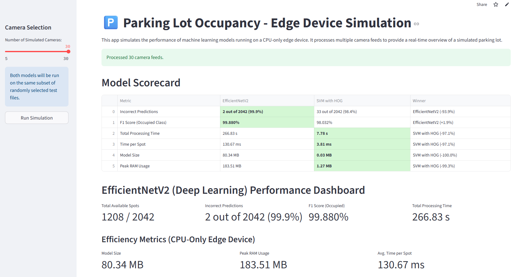
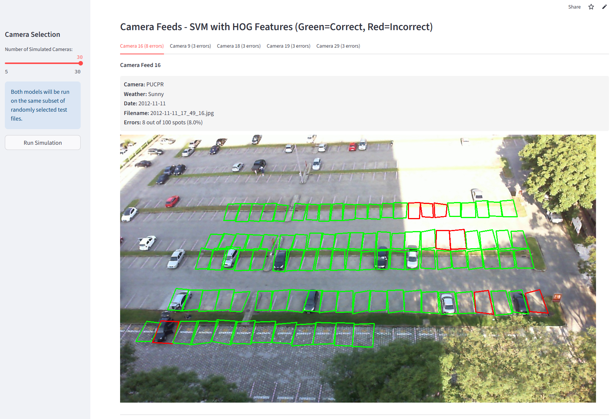

# aipi540-parking-lot-simulator

This Streamlit-based simulation tool, which accompanies [this final project](https://github.com/mwilliams31/aipi540-final-project), demonstrates how both models perform on edge devices with limited resources.

Features:
  - Processes the selected number of camera "feeds" on CPU-only hardware to simulate real-world deployment scenarios
  - Side-by-side comparison of SVM and EfficientNetV2 performance metrics
  - Tracks and displays memory usage, processing time, and model size
  - Shows annotated parking lot images with predictions highlighted

### Webapp Scorecard View

### Webapp Camera View

The application uses multiprocessing to isolate model execution and accurately measure resource usage. Models are tested against randomly selected images from the test set. The resulting scorecard displays key metrics including:

  - Prediction accuracy and F1 score
  - Processing time (total and per parking space)
  - Model size and peak memory consumption

To try the app, please visit: https://aipi540-parking-lot-simulator.streamlit.app/